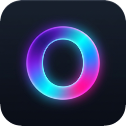
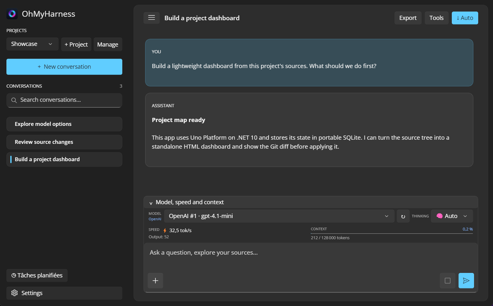
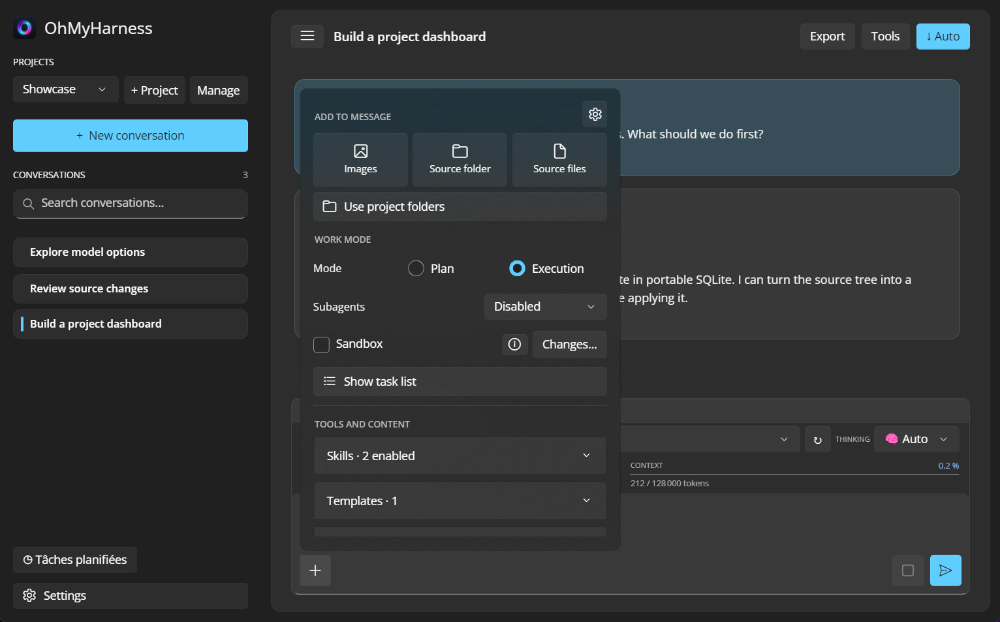
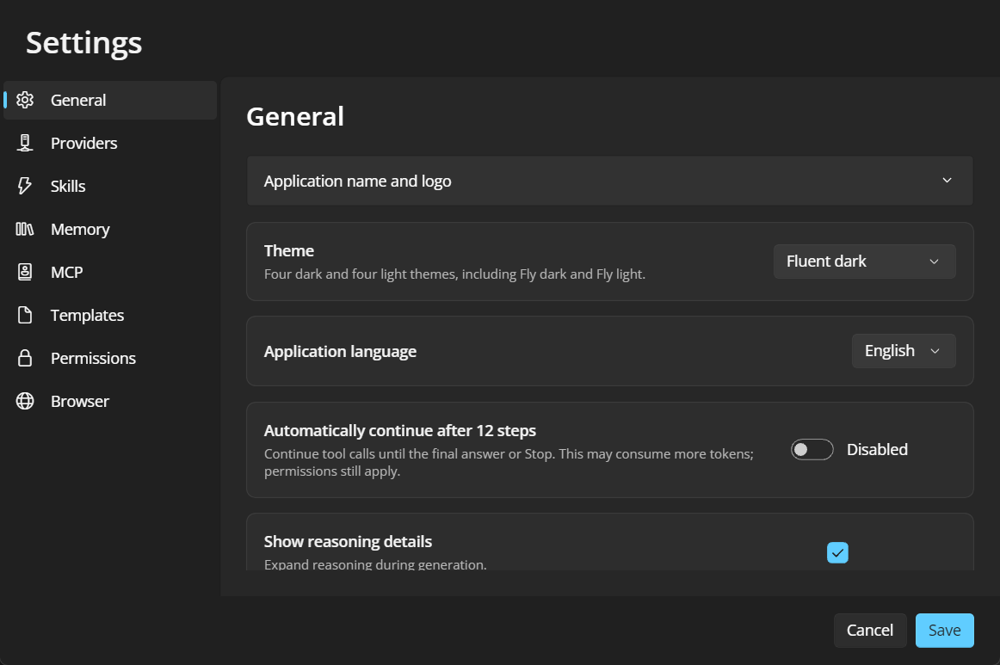
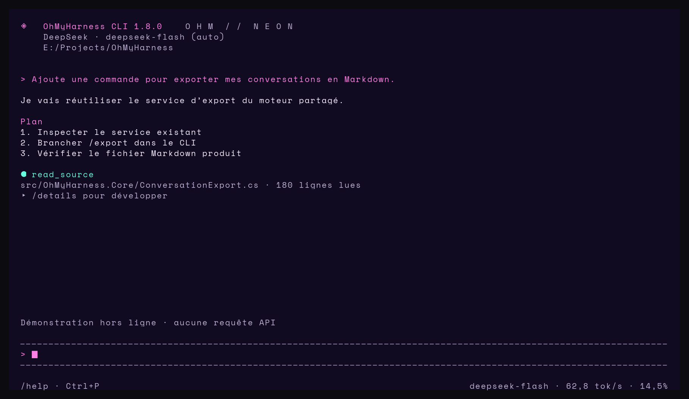
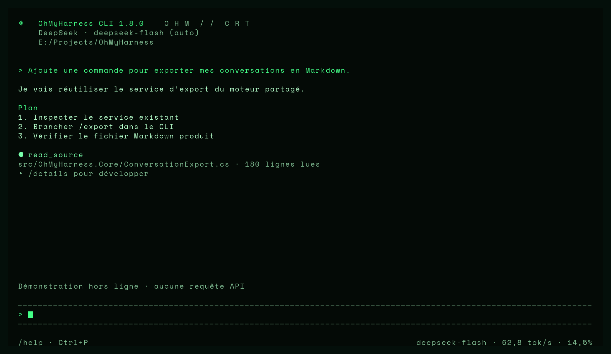
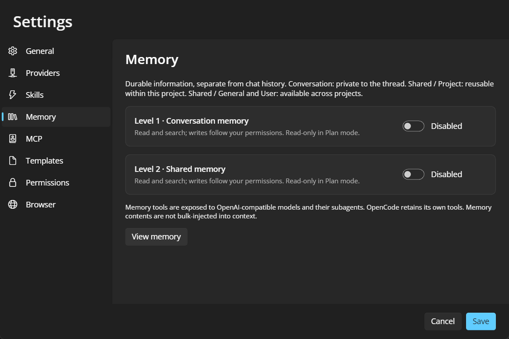

  

<h1 align="center">OhMyHarness</h1>

<strong>Your AI workspace in one portable EXE — GUI or CLI.</strong>

  <a href="https://github.com/loicdelaunay/OhMyHarness/releases/tag/v1.9.0">Download GUI</a>
  · <a href="https://github.com/loicdelaunay/OhMyHarness/releases/tag/cli-v1.9.0">Download CLI</a>
  · <a href="#quick-start">Quick start</a>
  · <a href="#build-from-source">Build from source</a>
  · <a href="docs/guide.md">User guide</a>

**Tired of powerful AI harnesses that need a stack of configuration and external services before the first conversation? What if a portable EXE handled the workspace?**

> **No OhMyHarness account. No telemetry to an OhMyHarness service. No subscription.** Just a standalone app with its workspace beside the EXE. Model requests go to the provider you choose, which may have its own costs.
>
> **Why build it this way?** I needed something straightforward enough to use at work, without a stack of extra services. And I thought it would be nice to share it, too. :)

OhMyHarness brings projects, concurrent chats, agents, sources, tools, and settings into one application. The Windows, macOS and Linux downloads ship as self-contained executables. Put one in a writable folder, connect a model provider, and start working. Its SQLite database and application-managed resources live beside the executable, so you can move the workspace by copying the folder after closing the app.

> **Available in GUI and CLI modes.** Choose the desktop workspace or the keyboard-driven terminal experience. Both use the same .NET agent engine, portable storage, projects, and conversations. [GUI download](https://github.com/loicdelaunay/OhMyHarness/releases/tag/v1.9.0) · [CLI download](https://github.com/loicdelaunay/OhMyHarness/releases/tag/cli-v1.9.0) · [CLI guide](docs/cli.md)

**Make it yours:** customize the desktop **theme, displayed application name, and logo/icon** in Settings. Keep the custom image beside the executable with a relative path to retain it when moving the folder. The CLI has its own color themes, including green/amber CRT and neon styles, with live previews; terminal fonts and CRT effects use an optional host-terminal profile.

Version **1.9.0**, available as both GUI and CLI downloads, includes an independent CLI font/size picker with bundled **VT323**, **Share Tech Mono** and **Space Mono**, plus **GitHub update checks** for both interfaces. GUI Settings → General and CLI `/update` can download a verified compatible release and restart while preserving portable data. See the [font and update guide](docs/cli.md#cli-themes-fonts-and-crt); these features are included in both current downloads where applicable.

The chat model itself is **not** bundled: cloud providers need network access and, depending on the service, an API key. Git, Docker/Podman, OpenCode, and Chrome MCP are optional integrations with their own prerequisites. The core app does not require a separate OhMyHarness server.

## New in the current downloads

**Since 1.8.0:** GUI and CLI packages for Windows x64, both Mac architectures and Fedora Linux x64, restored Intel Mac local RAG, reliable bundled-model retrieval, a fix for locked SQLite files during sandbox creation, and GUI response duration shown only on hover. Unix archives use `.tar.gz` to preserve executable permissions; see the [Mac guide](docs/macos.md) and [Fedora guide](docs/fedora.md).

Since the [GUI v1.0.0 release](https://github.com/loicdelaunay/OhMyHarness/releases/tag/v1.0.0), the source has gained the following updates. **GUI v1.9.0 and CLI v1.9.0** now package the same shared engine and current features in separate downloads for Windows x64, macOS Intel and Apple Silicon, and Fedora Linux x64.

- **Response styles:** DEFAULT, SHORT, PRAGMATIC, DETAILED and FUN, shared between GUI General settings and CLI `/settings`.
- **CLI editing:** selection, word navigation, copy/cut/paste and undo/redo; ordinary Backspace deletes one character.
- **A portable CLI:** compact chat, concurrent conversations, tools, agent questions, approvals, queue/steering, and plain-text or JSON automation.
- **Faster terminal setup:** guided `/connect` for DeepSeek, OpenAI, compatible/local APIs and OpenCode; automatic or manual model selection; inline `/` completion with arrow keys and Tab/Enter.
- **Personalized appearance:** immediate CLI theme previews, CRT Green, CRT Amber and Neon Synthwave; Electric dark/light palettes and improved theme contrast in the source for both interfaces.
- **Better conversations:** favorites, optional AI titles with a chosen model, response duration, compact queue controls and steadier streaming while reading earlier messages.
- **Stronger project support:** asynchronous discovery of nested project instructions, vision descriptions with custom guidance and component coordinates, and configurable portable logs.
- **Fresh portable workspaces:** launching the executable in a new folder creates fresh data instead of importing previous AppData conversations.

See the [full changelog](CHANGELOG.md) for version-by-version details. Both current downloads include their applicable changes through v1.9.0.

## Take a look

Real application capture with synthetic demo data. Project chats, model choice, response speed, context usage, and the composer stay in view.

<table>
  <tr>
    <td width="50%">
       
      Attach sources, select Plan or Execution, configure subagents, and toggle skills.
    </td>
    <td width="50%">
       
      Language, themes, providers, permissions, MCP, and more in one settings window.
    </td>
  </tr>
</table>

### Terminal interface

The CLI offers the same conversation workflow with its own terminal themes. These images are rendered from its built-in offline demo with synthetic content; no API request was made.

<table>
  <tr>
    <td width="50%">
       
      Neon Synthwave — conversation, tool activity and composer.
    </td>
    <td width="50%">
       
      CRT Green — the same workflow in a retro terminal palette.
    </td>
  </tr>
</table>

See the two-level memory settings

## Built-in skills — one click to enable

The built-in skills and their tool implementations are written in **.NET / C# and compiled into the executable**. This keeps the core toolset fast, simple and standalone, with permission checks and Plan/Execution restrictions for controlled access. Enable a skill with **one click** in the GUI, or toggle it through `/skills` in the CLI. Some skills also need a provider or host permission configured before use.

| Skill | What it gives the agent |
| --- | --- |
| **Complete design** | Guide a project from discovery questions and ideas through technology/visual choices, optional subagents, implementation, tests and visual verification. |
| **Source exploration** | List and read project files, including focused line ranges. |
| **Source editing** | Create, write and edit files in attached sources. |
| **Code search glob/grep** | Find files and text with line numbers. |
| **Multi-file patch with diff** | Preview and apply changes across multiple files. |
| **Terminal** | Run commands concurrently, manage terminal sessions and await results. |
| **Python scripts** | Create and execute scripts with the bundled Python runtime. |
| **Semantic search RAG** | Index and search sources using local multilingual embeddings or an API. |
| **Memory · Conversation** | Search and save facts scoped to the current conversation. |
| **Memory · Shared** | Reuse project, general and user knowledge across conversations. |
| **Bypass image AI** | Ask a dedicated vision model to describe images or identify components and coordinates. |
| **Web research** | Read browser pages, inspect DOM/JavaScript and interact with page behavior. |
| **AI browser access / DOM access** | Persist the embedded browser's AI access and interaction choices with the other skills. |
| **Application management** | List open application windows and their position and size. |
| **Mouse control** | Click, scroll or drag using screen, window or browser coordinates. |
| **Keyboard control** | Send text and key combinations to the supported desktop/browser host. |
| **Screenshots** | Capture the desktop, a specific application window or a browser page. |
| **Code review** | Guide the agent through reviewing changes and identifying issues. |
| **Planning** | Structure the work before execution. |
| **Summarization** | Produce concise summaries of useful context. |
| **Automatic skill creation** | Save reusable `SKILL.md` procedures globally or under `.omh-ai/skills` in a project. |

Custom `SKILL.md` procedures extend these compiled tools. Browser/desktop control depends on the GUI host; the CLI can use browser automation through MCP and filters unavailable desktop tools. Optional integrations keep their own prerequisites. Enabling a skill does not override permissions or provide a security sandbox; [container sandboxing](docs/sandbox.md) is a separate option.

## What is inside

| Area | Capabilities |
| --- | --- |
| **Models and providers** | Add as many OpenAI-compatible v1 or DeepSeek connections as you need, select their available models, connect OpenCode, or build a composed model with an orchestrator and specialized subagents. |
| **Projects and conversations** | Attach source folders to a project, run several chats at once, queue or steer messages while an agent works, fork or resume from an earlier message, and export a conversation to Markdown. |
| **Agent tools** | An integrated browser with controlled DOM and JavaScript access, multiple asynchronous terminals, source search and editing, a read-only Git diff viewer, file navigation, screenshots, mouse and keyboard controls, and bundled Python for scripts. |
| **Control and extensions** | Per-conversation Plan and Execution modes, optional container sandbox, scoped approval dialogs, configurable skills, project instructions from AGENTS.md, custom SKILL.md files, and MCP servers. |
| **Context that lasts** | Live token and speed indicators, context compaction, conversation and shared memory, semantic search with a bundled multilingual embedding model or an OpenAI-compatible embedding API, and an optional vision-model bridge. |
| **Desktop workflow** | Scheduled project tasks, structured agent checklists and questions, English/French UI, light/dark themes, custom app name and logo, and keyboard-friendly chat. |

Plan mode blocks modifying tools at the application boundary. The optional sandbox uses Docker or Podman and keeps a copy of approved sources separate from the real project until changes are reviewed. Permissions still apply to sensitive actions. See the [agent modes](docs/agent-modes.md) and [sandbox guide](docs/sandbox.md) for their exact boundaries.

## Quick start

1. Download the [GUI release](https://github.com/loicdelaunay/OhMyHarness/releases/tag/v1.9.0), or choose the [CLI release](https://github.com/loicdelaunay/OhMyHarness/releases/tag/cli-v1.9.0) for a terminal workspace. Select the archive for your OS and CPU.
2. Extract the archive into a **writable folder** and run <code>OhMyHarness.App.exe</code> on Windows or <code>./OhMyHarness.App</code> on macOS/Linux. The app creates its skills folder beside the executable.
3. Open **Settings → Providers**. Add a provider and its API key or endpoint. **Test connection** detects, selects, and saves its models; you can change that selection later.
4. Create a project, attach the source folders you want to share with its chats, and start a conversation.

For the CLI, put `omh.exe` (Windows) or `omh` (macOS/Linux) in a writable folder, launch it from your project directory, and enter `/connect`. Type `/` to discover commands; use ↑/↓ and Tab to complete them. No .NET installation is required for the published executables.

The integrated browser uses the system Web engine: Edge WebView2 on Windows, WebKit on macOS and WebKitGTK on Linux. Fedora GUI needs X11 and GTK3/WebKitGTK; see the [Fedora guide](docs/fedora.md). Git, container sandboxing, OpenCode, and Chrome MCP only need installation when you enable those integrations. Scheduled tasks run while OhMyHarness is open; they do not wake a sleeping computer.

## Portable data and privacy

OhMyHarness stores <code>database.sqlite</code>, <code>skills/</code>, <code>MCP.json</code>, browser profiles, and other application-managed resources beside the executable. In a fresh folder, it creates a new database with the required schema and starter settings, without importing old conversations from AppData. EF Core applies database migrations on startup. Do not place the app in a read-only directory such as <code>Program Files</code>. Close all instances before copying the folder to another machine.

API keys use Windows DPAPI, the macOS Keychain or, on Linux, AES-GCM with an owner-only `.linux-key` file beside SQLite. On Linux, keep the entire portable folder private and copy the key with the database; anyone who can read both can recover the API keys. Windows/macOS keys are tied to the OS account and need re-entry when moving accounts or systems. The rest of SQLite is **not encrypted**. Only content used for a request is sent to its selected model provider; attaching a source folder does not upload the whole folder automatically.

The bundled RAG embedding model runs locally and supports French and English. Its model file is part of the app release. Source clones use **Git LFS** to retrieve that file.

## Platforms and building

### Terminal workspace

OhMyHarness also includes a [modern CLI](docs/cli.md) with a responsive full-screen interface, searchable commands, concurrent chats, approvals, agent questions, tools and streaming context indicators. It uses the same engine and SQLite data as the desktop app.

~~~powershell
dotnet run --project src/OhMyHarness.Cli -- "E:\Projects\MyProject"
.\publish-cli.ps1 -OutputDirectory artifacts\CLI
# Then: artifacts\CLI\omh.exe
~~~

Use <code>omh run "Review this project" --project . --json</code> for automation. <code>/connect</code> configures a provider, Ctrl+P opens the command palette, and <code>--database</code> selects an existing desktop workspace.

### Desktop application

The shared application is built with **Uno Platform and .NET 10**. The published Windows x64 release uses Uno Desktop; a native WinUI 3 target is also available. GUI and CLI downloads also include unsigned macOS Intel and Apple Silicon builds. Automated builds and tests run on both architectures; native interactions still need validation on a real Mac. The macOS downloads are not signed or notarized.

For a Windows source build, install the .NET 10 SDK and Git LFS. The native WinUI target additionally needs the Windows/WinUI development tools.

~~~powershell
git clone https://github.com/loicdelaunay/OhMyHarness.git
cd OhMyHarness
git lfs pull
dotnet run --project tests/OhMyHarness.Tests -c Release
.\publish.ps1 -OutputDirectory artifacts\GUI
~~~

Publications use `artifacts/GUI` and `artifacts/CLI`. Temporary test publications belong under `artifacts/TEMP` and should be removed after testing. Add `-NativeWinUI` to the GUI publish command to select the native WinUI target. On a Mac with the .NET 10 SDK and Xcode command-line tools, use <code>bash ./publish-macos.sh arm64</code> or <code>x64</code>; signing and notarization are separate steps.

The [Windows v1.0.0 release](https://github.com/loicdelaunay/OhMyHarness/releases/tag/v1.0.0) passed 473 offline .NET checks and an application UI smoke scenario. The macOS target is not included in that runtime validation.

## More documentation

Detailed guides: [browser, RAG, and subagents](docs/browser-rag-agents.md), [memory](docs/memory.md), [custom skills](docs/skill-authoring.md), [MCP](docs/mcp.md), [scheduled tasks and models](docs/uno-tasks-models.md), [macOS](docs/macos.md), and the [full user guide](docs/guide.md).

OhMyHarness is available under the [MIT license](LICENSE).
